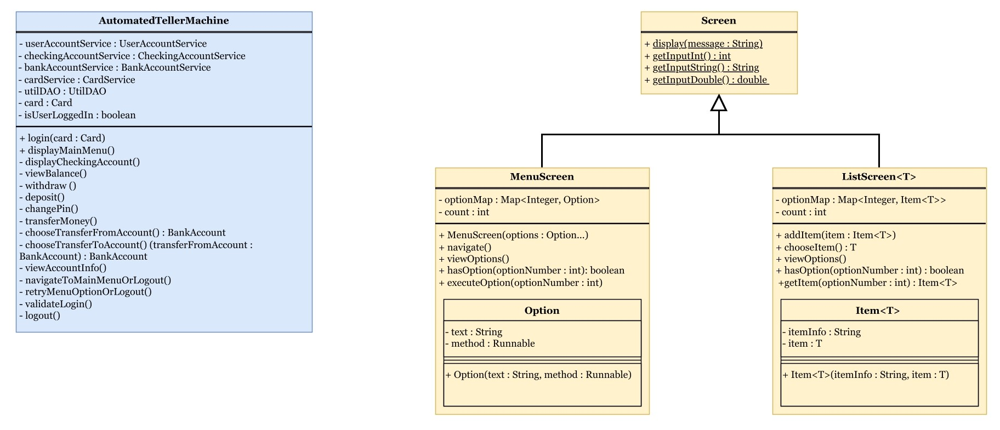
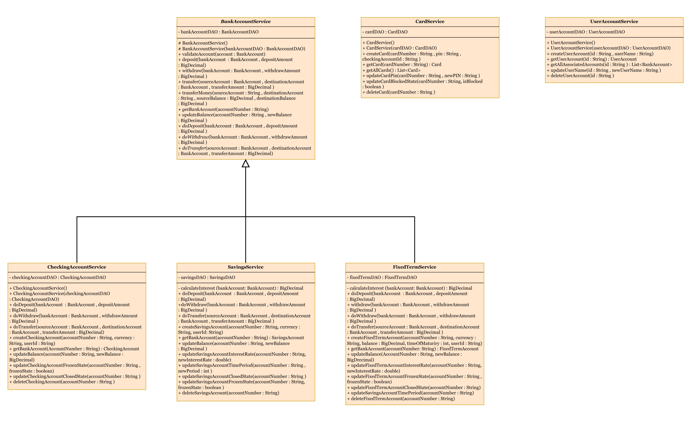
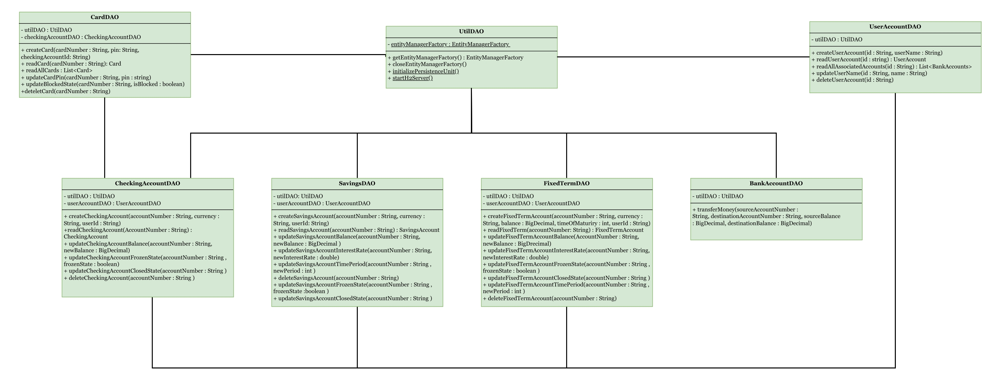
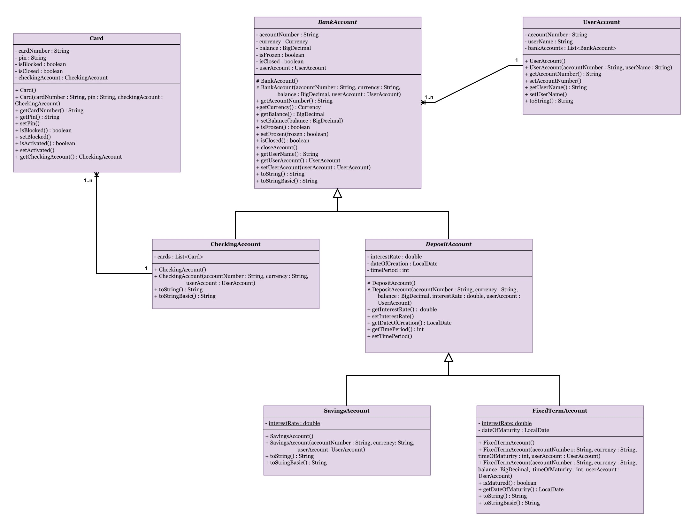

# Automated Teller Machine (ATM) Project

The Automated Teller Machine (ATM) project is a Java-based simulation of an ATM system. It provides functionalities such
as account balance inquiries, withdrawals, deposits, money transfers, and PIN change. This project demonstrates the use
of object-oriented programming principles in a financial application context.

## Features

- **Login:** Imitates the real-life authentication at an ATM using a card and PIN.
- **View accounts info:** Lets you see the basic info of the accounts you own. (Account type, Balance, etc.)
- **View Balance:** Check the balance of the checking account associated to the current card.
- **Withdraw Funds:** Withdraw money from the checking account associated to the current card.
- **Deposit Funds:** Deposit money into the checking account associated to the current card.
- **Transfer Money:** Transfer money between different owned bank accounts.
- **Change PIN:** Change the card PIN.
- **Logout:** Securely logout from the ATM system.

## Tech Stack

- **Java:** Main platform and language used to create and run the application.
    - **JUnit:** Framework for writing and running tests to ensure code quality and correctness.
    - **Mockito:** Framework for creating mock objects in tests to isolate and test individual components.
    - **Hibernate:** An ORM (Object-Relational Mapping) framework used to map Java objects to database tables, providing
      a high-level abstraction for database interactions.
- **Maven:** Dependency management and build automation tool that ensures all required libraries are included and
  up-to-date.
- **Databases:**
    - **H2:** Default relational database management system used for persisting ATM data.
    - **MySQL:** Relational database management system.

## Class diagram

This project uses a layered architecture, a common approach to separate concerns, promote reusability, and facilitate
maintenance.

- **Main app and utility classes**
  

- **Service classes**
  

- **DAO classes**
  

- **Entity classes**
  

## Configuration

- This app supports two types of databases: MySQL and H2. The persistence units for both databases are added in the
  `persistence.xml` file found in `src\main\resources\META-INF`.
- Configurations of the chosen persistence unit can be changed from `database-config.properties` file found
  in `ATM-Console\database-config.properties`.

In the `database-config.properties` file you will find four properties that can be changed.

- `persistenceContext`: This field determines which database configuration the application should use.
- `username`: This field is used to specify the username for connecting to the database.
- `password`: This field is used to specify the password for the database connection.
- `jdbc.connectionUrl`: This is the connection URL that the application uses to connect to the database.

If you want to use H2 database you will need to:

- `persistenceContext`: Set to `h2_database`. Indicates that the application should use an in-memory H2 database.
- `username`: Since the `persistenceContext` is set to `h2_database`, no username is required, so this field is left
  blank.
- `password`: Similarly, no password is needed for the H2 database, so this field is left blank.
- `jdbc.connectionUrl`:  Since `h2_database` is being used, this field is left blank because the application will use a
  default in-memory H2 database connection.

If you want to use MySQL database you will need to:

- If you don't have the program, install MySQL in your PC.
- Create a new schema in MySQL.

In `database-config.properties` file:

- `persistenceContext`: Set to `mySQL_database`. Indicates that the application should connect to a MySQL database.
- `username`: Using MySQL, you would need to enter the database username here, like `username=root`.
- `password`: Using MySQL, you would enter the corresponding password for the database user,
  like `password=secretpassword`.
- `jdbc.connectionUrl`: If you were to switch to using MySQL, you would need to provide the MySQL connection URL here.
  Example: `jdbc:mysql://127.0.0.1:3306/<YOUR_DB_NAME>`.
- After running the project one time, to facilitate the creation of the tables in your MySQL database, manually add data
  in the MySQL database.

## Run Locally

### Prerequisites

- JDK 21

### Steps

Clone the project

```bash
git clone https://github.com/MiMi-A98/ATM-Console.git
```

Go to the project directory

```bash
cd my-project
```

Compile the source code

```bash
./mvnw clean package
```

Run the app

```bash
java -jar target/atm-console.jar
```

## Running Tests

To run tests, run the following command from the root folder of the project:

```bash
./mvnw clean test
```

