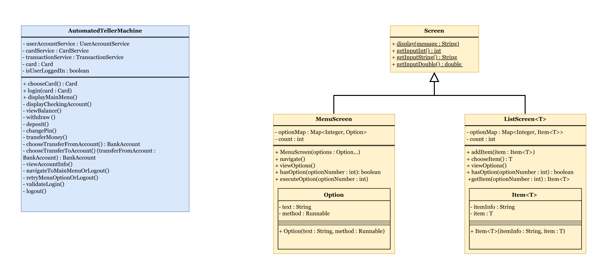

# Automated Teller Machine (ATM) Project

The Automated Teller Machine (ATM) project is a Java-based simulation of an ATM system. It provides functionalities such
as account balance inquiries, withdrawals, deposits, money transfers, and PIN change. This project demonstrates the use
of object-oriented programming principles in a financial application context.

## Features

- **Login:** Imitates accessing an ATM using a card and PIN.
- **View accounts info:** Lets you see the basic info of the accounts you own. (Account type, Balance, etc.)
- **View Balance:** Check the balance of the checking account associated to the current card.
- **Withdraw Funds:** Withdraw money from the checking account associated to the current card.
- **Deposit Funds:** Deposit money into the checking account associated to the current card.
- **Transfer Money:** Transfer money between different owned bank accounts.
- **Change PIN:** Change the card PIN.
- **Logout:** Imitates logging out of the ATM and exits the application.

## Tech Stack

- **Java:** Main platform and language used to create and run the application.
    - **JUnit:** Framework for writing and running tests to ensure code quality and correctness.
    - **Mockito:** Framework for creating mock objects in tests to isolate and test individual components.
    - **Hibernate:** An ORM (Object-Relational Mapping) framework used to map Java objects to database tables, providing
      a high-level abstraction for database interactions.
- **Maven:** Dependency management and build automation tool that ensures all required libraries are included and
  up-to-date.
- **Supported Databases:**
    - **H2:** In-memory database accessed in a browser.
    - **MySQL:** External database accessed via its relational database management system.

## Class diagram

This project uses a layered architecture, in order to separate concerns, promote reusability, and facilitate
maintenance.

- **Main app and screen utility classes**
  

- **Service classes**
  

- **DAO classes**
  

- **Entity classes**
  

## Configuration

The `database-config.properties` file, found in the root directory, is used to set the connection details for the target
database.

- H2 database configuration:
    - `persistenceContext`: Set to `h2_database`.
    - Leave other property values empty.
    - By default, the database includes demo data while the app is running.


- MySQL database configuration:
    - `persistenceContext`: Set to `mySQL_database`.
    - `username`: The username used to access the MySQL DBMS.
    - `password`: The password associated to the database user.
    - `jdbc.connectionUrl`: The JDBC connection URL to the database.
      Example: `jdbc:mysql://127.0.0.1:3306/<YOUR_DB_NAME>`.
    - In order to create the database tables, run the application once. Data must be added manually via the MySQL DBMS.

## Run Locally

### Prerequisites

- JDK 21
- (If using H2) A web browser
- (If using MySQL) MySQL DBMS configured and with added data

### Steps

Clone the project

```bash
git clone https://github.com/MiMi-A98/ATM-Console.git
```

Go to the project directory

```bash
cd my-project
```

Compile and package the project

```bash
./mvnw clean package
```

Run the app

```bash
java -jar target/atm-console.jar
```

To view the database in the H2 console, open `http://localhost:8082` in a browser while the app is running and fill in
the details:

- `Saved settings:` Select `Generic H2 (Embedded)`.
- `Driver class:` Set to `org.h2.Driver`.
- `JDBC URL:` Set to `jdbc:h2:file:~/h2_database;AUTO_SERVER=TRUE`.
- `User name:` Set to `sa`.
- `Password:` Leave empty.

## Running Tests

To run tests, run the following command from the root folder of the project:

```bash
./mvnw clean test
```

